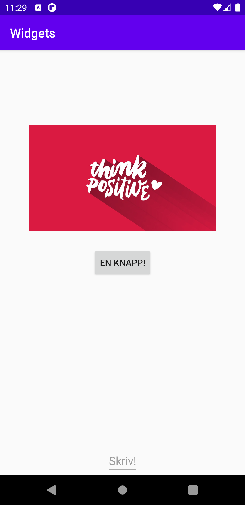

# Rapport Widgets

I denna rapport beskrivs uppgiften Widgets i Programmering av mobila applikationer. Denna uppgift gick ut på att använda en layout och minst tre vyer i sin applikation. För vyer valdes Button, EditText och ImageView, och dessa ligger inuti en ConstraintLayout.

Nedan visas kod för vyen Button;

    <Button
        android:id="@+id/MyBtn"
        android:text="En knapp!"
        android:layout_width="wrap_content"
        android:layout_height="wrap_content"
        app:layout_constraintBottom_toBottomOf="parent"
        app:layout_constraintLeft_toLeftOf="parent"
        app:layout_constraintRight_toRightOf="parent"
        app:layout_constraintTop_toTopOf="parent" />

Här har till exempel knappen fått ett id via andrid:id och en text via andrid:text. App:layout ger knappen dess position, medan andriod:layout ger knappen sitt utseende där knappens innehåll omsluts.

Sedan används knappen också i MainActivity och ges här en ClickListener med denna kod:

    Button b = findViewById(R.id.MyBtn);

        b.setOnClickListener(new View.OnClickListener() {
            @Override
            public void onClick(View view) {
                Log.d("==>", "We clicked on En knapp!");
            }
        });

Med hjälp av ovan kod får vi ett meddelande i Logcat när vi klickar på knappen, vilket gör att vi kan kontrollera att knappen faktiskt går att klicka på.

Nedan synd det färdiga resultaten av denna uppgift:

